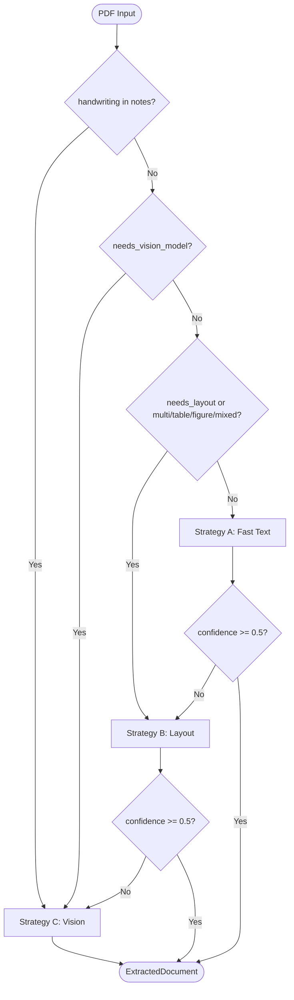
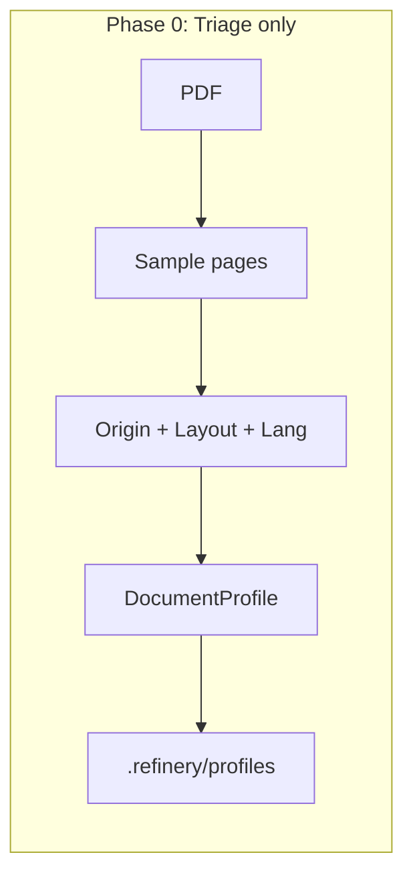
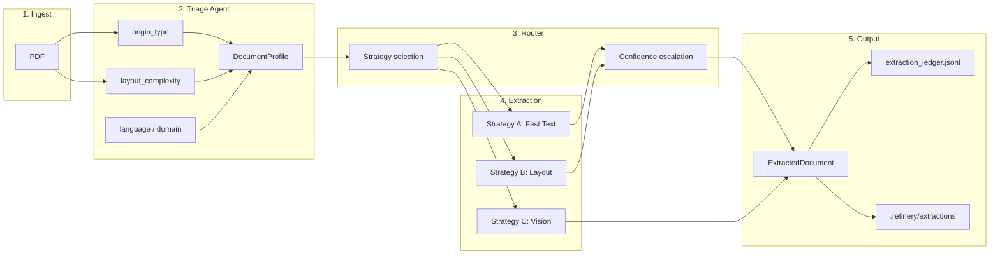
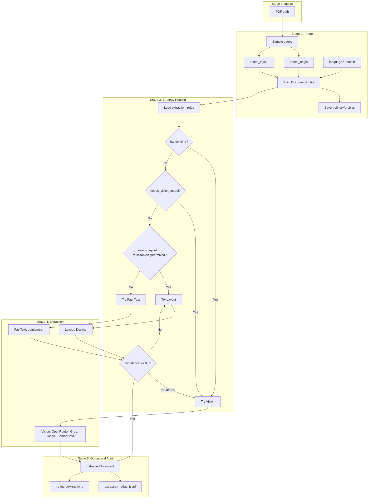
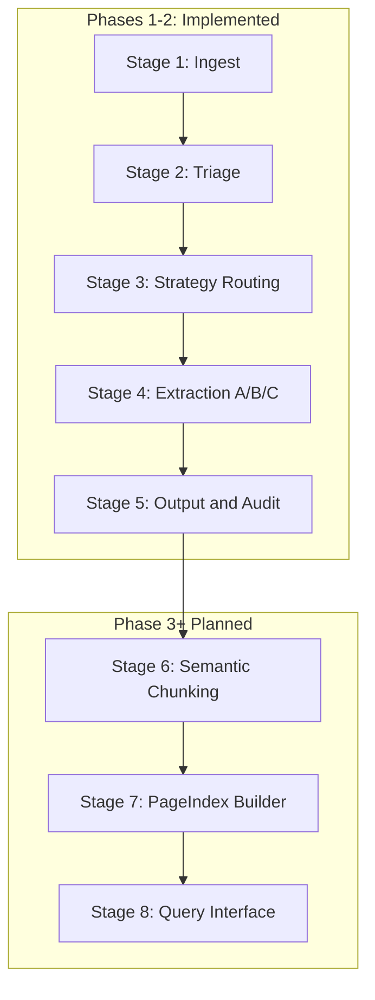

# Document Intelligence Refinery — Phase 1 & 2 Report

This report summarizes the Domain Notes (Phase 0 deliverable), extraction strategy decision tree, failure modes, pipeline and architecture diagrams, and cost analysis for the multi-strategy extraction engine implemented in **Phase 1 (Triage)** and **Phase 2 (Extraction)**. It covers the implemented scope only; next steps (e.g. chunking, LDU production) are planned for Phase 3.

---

## 1. Domain Notes (Phase 0 Deliverable)

### 1.1 Extraction Strategy Decision Tree

The router selects a strategy using the following logic. Thresholds are defined in `rubric/extraction_rules.yaml` (fallback: `configs/extraction_rules.yaml`).

| Condition | Strategy | Notes |
|-----------|----------|--------|
| `likely_handwritten` in `profile.classification_notes` | **C** (Vision) | Bypass A/B; go straight to VLM. |
| `estimated_extraction_cost == "needs_vision_model"` | **C** (Vision) | e.g. `origin_type == "scanned_image"` or language unknown. |
| `estimated_extraction_cost == "needs_layout_model"` **or** `layout_complexity` in `multi_column`, `table_heavy`, `figure_heavy`, `mixed` | **B** (Layout) first | Try Docling; if confidence < 0.5, escalate to **C**. |
| Else | **A** (Fast Text) first | Try pdfplumber; if confidence < 0.5 → **B**; if still < 0.5 → **C**. |

**Confidence gate (Strategy A):** A page is accepted for Fast Text only if:

- Character count ≥ `min_chars_per_page` (100).
- Image area / page area ≤ `max_image_ratio` (0.50).
- Character density (char area / page area) ≥ `min_char_density` (0.02).

Document-level confidence is the **minimum** over all pages. If it is below `confidence_escalation_threshold` (0.5), the router escalates to the next strategy.

**Empirical rationale (Phase 0):** Thresholds were chosen so that (1) **density 0.02** separates sparse or image-dominated pages (e.g. Amharic-only or low-text pages) from normal text—below this, Fast Text is unreliable and escalation is required; (2) **min 100 chars/page** excludes empty or near-empty pages and scanned pages with little OCR output; (3) **max image ratio 0.50** avoids treating image-dominated pages as text; (4) **confidence 0.5** balances avoiding unnecessary escalation on borderline docs vs. catching failed extractions. Full rationale and tooling choices (e.g. why Docling for Strategy B—table fidelity, Mac-friendly, no GPU required) are in `DOMAIN_NOTES.md`; exact values live in `rubric/extraction_rules.yaml` (fallback: `configs/extraction_rules.yaml`).

**Strategy B sanity check:** If profile is `table_heavy` but Docling returns 0 tables, Layout returns confidence 0 and the router escalates to Vision. **Page counts** are document-specific (e.g. in runs, the ETS annual report PDF had 94 pages; other corpus PDFs may differ—verify per document).

### 1.2 Failure Modes Observed Across Document Types

We align failure modes with the **four document classes** used in the rubric and triage: **(1) Native Financial** — `origin_type=native_digital`, `domain_hint=financial` (e.g. digital annual reports); **(2) Scanned Financial** — `scanned_image` or `searchable_scan` with financial content; **(3) Legal / Procurement** — legal or procurement documents (e.g. contracts, tender notices); **(4) Technical / General** — technical, medical, or general domain. Each failure mode below is linked to the relevant class(es) and to a **specific corpus file** where applicable.

| Document class | Failure mode | Mitigation | Corpus file (example) |
|----------------|--------------|------------|------------------------|
| **Scanned Financial** | Scanned image (no OCR): Fast Text returns empty or garbage; character count &lt; 100 or density very low. | Triage sets `origin_type=scanned_image` → router sends to Vision (C). | `Audit Report - 2023.pdf` (if scan-only pages present). |
| **Scanned Financial** / **Legal** | Searchable scan (OCR layer): Fast Text can get text but with OCR fonts; confidence reduced by OCR penalty; layout may be wrong. | Triage sets `needs_layout_model` or mixed; router uses Layout (B) first; low confidence escalates to C. | `2013-E.C-Procurement-information.pdf` (searchable scan). |
| **Native Financial** / **Legal** | Table-heavy: Fast Text returns flat text, no table structure. | Triage sets `layout_complexity=table_heavy` → Layout (B). If Docling finds 0 tables, confidence=0 → escalate to C. | `ETS_Annual_Report_2024_2025.pdf`, `2013-E.C-Procurement-information.pdf` (table-heavy sections). |
| **Native Financial** | Figure-heavy / multi-column: Fast Text loses reading order and figures. | Triage sets figure_heavy/multi_column → Layout (B). | `ETS_Annual_Report_2024_2025.pdf` (94 pages; figure_heavy → B). |
| **Technical / General** | Handwritten or sparse text: Low char density; triage can add `likely_handwritten`. | Router sends directly to Vision (C). | Sparse/low-density pages → min confidence triggers escalation. |
| Any | Empty or near-empty pages: Char count &lt; 100 or density ≤ empty threshold. | Fast Text confidence 0 for that page; doc-level confidence can trigger escalation. | Multi-page docs with empty pages (e.g. section dividers). |
| Any (Vision path) | Vision budget exceeded: Many pages; cost would exceed `vision.budget_per_document_usd`. | Vision stops early; document returned with `status="truncated_budget"`. | Cap enforced; e.g. long `Audit Report - 2023.pdf` under paid model. |
| Any (Vision path) | Malformed VLM JSON: Vision model returns non-JSON or broken JSON. | VisionRetryHandler retries parsing (e.g. extract from markdown code block); fallback to raw text in one text block. | — |
| **Native Financial** / **Legal** | Docling table export deprecation: Warnings from `TableItem.export_to_dataframe()` without `doc`. | Cosmetic; extraction still completes. Can be fixed by passing `doc` when Docling API requires it. | Figure-heavy multi-table PDFs (e.g. annual report); extraction succeeds. |

### 1.3 Pipeline Diagram (High-Level)

**Phase 0 (Triage-only):** PDF → sample pages → origin + layout + language/domain → DocumentProfile → save to `.refinery/profiles/`. No extraction step.

**Full pipeline (Phases 1–2):**

---

## 2. Architecture Diagram — Full 5-Stage Pipeline with Strategy Routing

The diagram below is the **implemented** pipeline (Phases 1–2): ingest → triage → strategy routing → extraction (A/B/C) → output and audit. Vision uses OpenRouter with fallbacks to Groq, Google Gemini, and SambaNova (model names and budget are in `rubric/extraction_rules.yaml`).

**Complete system view (rubric requirement):** The second diagram includes the **RAG stages** (Semantic Chunking, PageIndex Builder, Query Interface) planned for Phase 3+. These are not yet implemented but are part of the full system architecture.

**Full pipeline including RAG (Phase 3+ planned):** The following diagram shows the complete system view with post-extraction RAG stages. Stages 6–8 are planned for later phases.

**Stage summary**

| Stage | Description |
|-------|-------------|
| **1. Ingest** | PDF path (and optional doc_id). |
| **2. Triage** | Sample pages → origin, layout, language, domain → DocumentProfile → save to `.refinery/profiles/`. |
| **3. Strategy routing** | Load rules; apply decision tree (handwriting → vision; needs_vision → vision; needs_layout or layout flags → layout; else fast text); run chosen extractor; if confidence &lt; threshold, escalate B→C or A→B→C. |
| **4. Extraction** | Run one or more of FastText (pdfplumber), Layout (Docling), Vision (OpenRouter with fallbacks: Groq, Google Gemini, SambaNova). |
| **5. Output & audit** | Build ExtractedDocument; append to `extraction_ledger.jsonl`; optionally save to `.refinery/extractions/{doc_id}.json`. |
| **6. Semantic Chunking (planned)** | Chunk extracted text/structure into semantically coherent units for retrieval. |
| **7. PageIndex Builder (planned)** | Build index (e.g. vector or hybrid) over chunks with page/document provenance. |
| **8. Query Interface (planned)** | RAG query endpoint over the index for question-answering and retrieval. |

**Router escalation logic (excerpt):** Handwriting or `needs_vision_model` → Vision only. Else if `needs_layout_model` or layout in multi/table/figure/mixed → try Layout; if confidence &lt; 0.5, try Vision. Else try Fast Text; if confidence &lt; 0.5, try Layout; if still &lt; 0.5, try Vision. See `src/refinery/agents/extractor.py`.

---

## 3. Cost Analysis — Estimated Cost per Document by Strategy Tier

| Strategy | Tier | Tool | Estimated cost per document | Notes |
|----------|------|------|------------------------------|--------|
| **A — Fast Text** | Low | pdfplumber | **~$0** | CPU only; no external API. Cost is machine time. |
| **B — Layout-Aware** | Medium | Docling | **~$0** (CPU) or low (GPU if used) | Local Docling run. No per-document API fee unless GPU/cloud. |
| **C — Vision-Augmented** | High | VLM via OpenRouter (or Groq / Google / SambaNova) | **Variable; configurable cap** | Per-page image + prompt/completion tokens. Default budget cap: `vision.budget_per_document_usd` (e.g. **$1.0**). With free-tier model (`google/gemini-2.0-flash-exp:free`), effective cost can be **$0** within provider limits. |

### 3.1 Strategy A (Fast Text)

- **Cost:** Effectively **$0** per document (no third-party API).
- **Drivers:** Number of pages (pdfplumber open + per-page extract), CPU.

### 3.2 Strategy B (Layout)

- **Cost:** **$0** per document for typical local Docling run; optional GPU or hosted Docling would add marginal cost.
- **Drivers:** Page count, complexity (tables/figures), CPU/GPU.

### 3.3 Strategy C (Vision)

- **Cost:** Depends on page count, image size, and model pricing.
  - **Free tier (e.g. `google/gemini-2.0-flash-exp:free` on OpenRouter):** **$0** per document within provider rate limits (e.g. 20 req/min, 200 req/day on OpenRouter free variant).
  - **Paid:** Indicative range ~\$0.01–0.05 per page for typical vision models (source: OpenRouter and provider pricing docs, 2025). A 50-page doc might be **$0.50–2.50** without free tier. **Fallback providers** (Groq, Google Gemini, SambaNova) each have their own free/paid tiers—cost varies by provider.
- **Cap:** No single document can exceed `vision.budget_per_document_usd` (default **$1.0**). When the next page would exceed the cap, extraction stops and the document is marked `truncated_budget`; **actual cost per doc never exceeds the cap** (e.g. a 92-page doc might complete only ~20–40 pages before hitting $1, depending on model).
- **Tracking:** `vision_cost_usd` in `ExtractedDocument.metadata`; `cost_usd` in `extraction_ledger.jsonl`.

### 3.4 Non-monetary cost (latency)

- **Strategy A:** Seconds per document (CPU-bound, page count linear).
- **Strategy B:** Tens of seconds to about one minute per document (Docling; depends on page count and table/figure density).
- **Strategy C:** Minutes per document (page-bound; one API call per page, plus retries/fallbacks).

### 3.5 Example: 50-doc corpus

If ~90% of docs use A or B and ~10% use Vision (5 docs): **total cost ≈ $0** with free-tier Vision; with paid Vision at cap $1/doc for those 5, **total ≤ $5**. Typical total runtime: dominated by Vision docs if present.

### 3.6 Summary Table

| Strategy | Typical cost/doc | Cap / notes |
|----------|------------------|-------------|
| A — Fast Text | $0 | N/A |
| B — Layout | $0 | N/A (local Docling) |
| C — Vision (free-tier) | $0 | Within provider rate limits |
| C — Vision (paid) | ~\$0.01–0.05/page | Per-doc cap (e.g. $1); Groq/Google/SambaNova vary by provider |

---

## Conclusion

This report documents the Domain Notes, extraction decision tree, failure modes, pipeline and architecture (Phases 1–2), and cost analysis for the Document Intelligence Refinery. Thresholds and rationale are detailed in `DOMAIN_NOTES.md`; machine-readable rules are in `rubric/extraction_rules.yaml` and `configs/triage_rules.yaml`. **Next steps:** chunking and LDU production (Phase 3).

---

## References

- **Phase 0 / thresholds and rationale:** `DOMAIN_NOTES.md`
- **Machine-readable rules:** `rubric/extraction_rules.yaml` (primary), `configs/extraction_rules.yaml` (fallback), `configs/triage_rules.yaml`
- **Key code paths:** `src/refinery/agents/extractor.py` (router), `src/refinery/agents/triage.py`, `src/refinery/strategies/*` (FastText, Layout, Vision), `src/refinery/models/document_profile.py` (estimated_extraction_cost)
- **Audit log:** `.refinery/extraction_ledger.jsonl`
- **Cost / model config:** `rubric/extraction_rules.yaml` (vision.budget_per_document_usd, model_cheap, model_quality)
